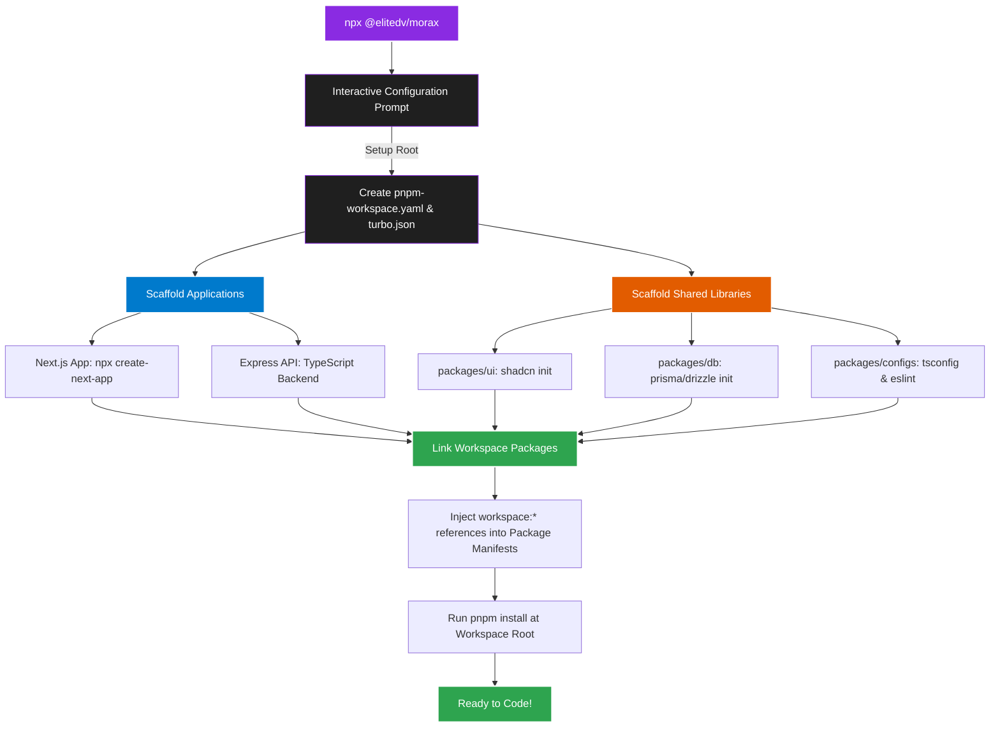

<div align="center">

<div style="display: flex; align-items: center; justify-content: center; gap: 18px; margin-bottom: 12px;">
  
  <h1 style="border-bottom: none; margin: 0; font-size: 2.8rem; font-weight: 900; letter-spacing: 3px; line-height: 1;">MORAX</h1>
</div>

### _The Next-Generation `pnpm` Monorepo & Workspace Orchestrator_

[](https://www.npmjs.com/package/@elitedv/morax)
[](https://www.typescriptlang.org/)
[](https://pnpm.io/)
[](https://opensource.org/licenses/MIT)

<p align="center">
  A highly polished, interactive CLI that bootstraps custom, modern, high-performance <b>pnpm workspaces</b> in seconds.
</p>

[Quick Start](#-quick-start) • [Features](#-features-matrix) • [Workflow](#-dynamic-workspace-orchestration) • [Contributing](#-contributing)

---

</div>

## 🚀 Quick Start

Initialize your new workspace instantly using:

```bash
npx @elitedv/morax
```

---

## ⚡ Dynamic Workspace Orchestration

Morax acts as a smart orchestrator. Instead of copy-pasting outdated boilerplate code, it executes official framework CLIs and programmatically connects them under the hood:



---

### Interactive Prompts

Morax guides you step-by-step to customize your developer experience:

```ansi
? What is the name of your workspace? › my-morax-monorepo
? Which applications would you like to scaffold? ›
 🎯 [x] Next.js Web App
 🔌 [x] Express.js API
? Which packages would you like to configure? ›
 🎨 [x] Shared UI Library (Tailwind + Shadcn)
 🗃️ [x] Shared Database Client (Prisma + PostgreSQL)
 ⚙️ [x] Shared Linting & TypeScript Configurations
```

### Launch Development Server

Once setup is complete, navigate into your directory and launch the unified development server:

```bash
cd my-morax-monorepo
pnpm dev
```

---

## ✨ Features Matrix

### 🛠️ Workspace & Orchestration

- **create pnpm workspace monorepo with ease**
- **Zero-Config Workspaces:** Complete setup of `pnpm-workspace.yaml` and unified root lockfiles.
- **Turborepo Pipeline:** Lightning-fast, cached builds and concurrent tasks (`dev`, `build`, `lint`).
- **Automated Symlinking:** Direct injection of `"@workspace/ui": "workspace:*"` cross-package references.
- **Always Up-to-Date:** Pulls from the latest official framework generators dynamically.

---

## 🤝 Contributing

We welcome contributions to make Morax even better!

1. **Fork** the repository
2. **Create** your feature branch (`git checkout -b feature/AmazingFeature`)
3. **Commit** your changes (`git commit -m 'Add some AmazingFeature'`)
4. **Push** to the branch (`git push origin feature/AmazingFeature`)
5. **Open** a Pull Request

---

## 📝 License

Distributed under the MIT License. See [LICENSE](file:///c:/Users/runak/Coding/Development/Morax/LICENSE) for details.

---

<div align="center">
  <sub>Made with 💜 by <a href="https://github.com/AshutoshDM1">AshutoshDM1</a> & <a href="https://github.com/elitedv">EliteDV Team</a></sub>
</div>
